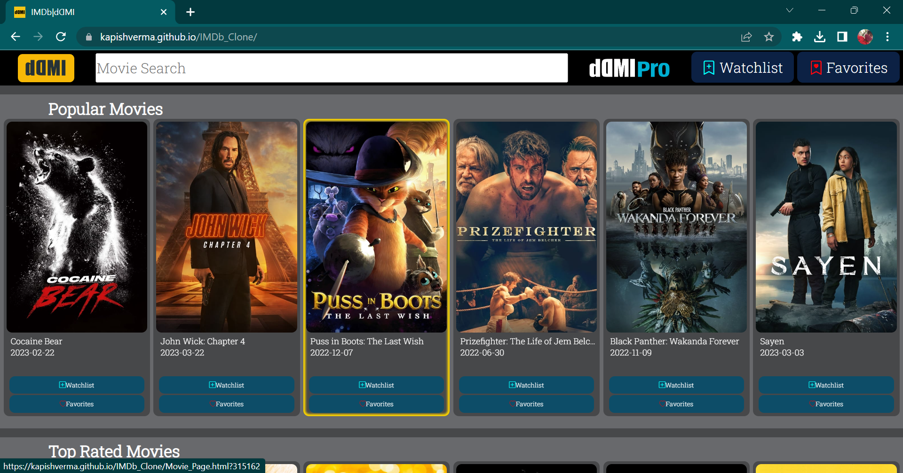
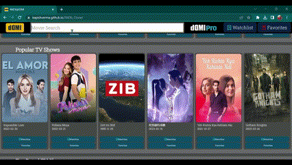
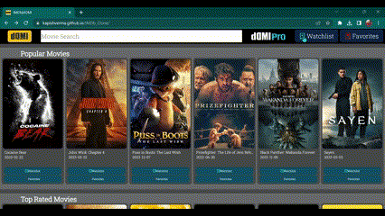
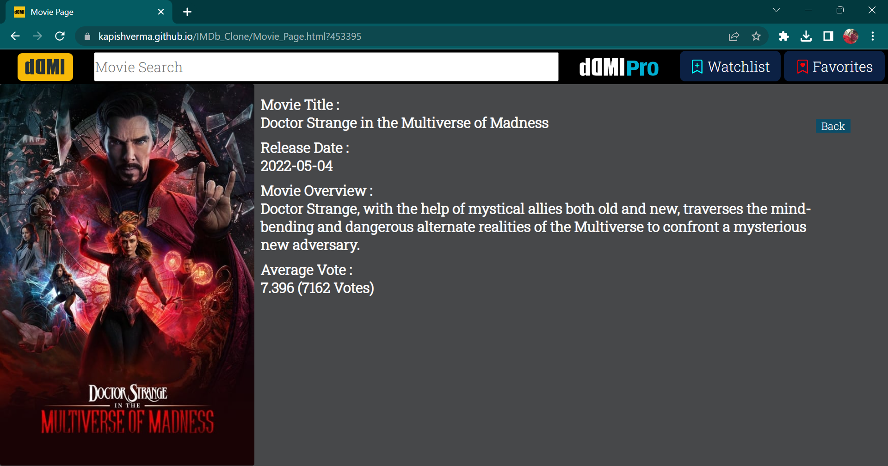

> # [IMDb|dꓷMI](https://kapishverma.github.io/IMDb_Clone/ "Want to try? Hit this link")

 >## Initialising

 1. As the page loads
  1. **initialising()** function gets called
  1. and result willl be like this
  
  
  

  ---

 >## Search Movie

1. To search type movie name(**related Keywords**) 
1. search result will **update** as you enter any Keywords(key) 

  
  ---
 >## Add to WatchList and Favorite_List
1. Below  every card, there are two buttons
1. By pressing any one of then, you can either add to **watchlist** or **favorites**

  
---
>## Movie Page
   

1. If you want to see any movie details, Just tap on it's image ( home-screen / search-result / favorite or watchlist anywhere)
1. A link is attached with every image , that will take you to the movie page

  

>  __You can see every event in__ **Console**
